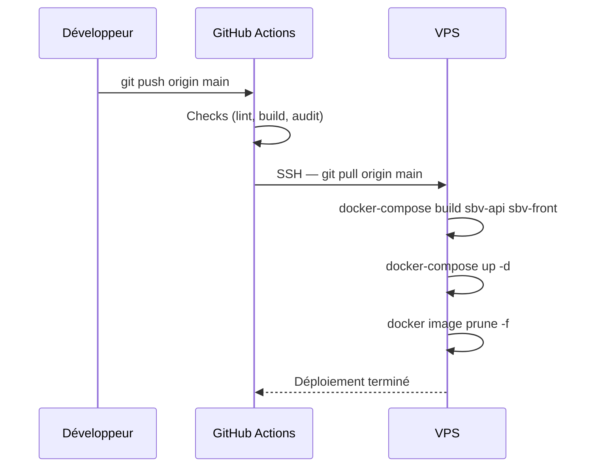

# Cartographie de déploiement

> Vue infrastructure — état réel de production

---

## Infrastructure de production

```
Internet
   │
   ▼
VPS (Ubuntu) — 78.138.58.95:80
   │
   ▼
Nginx 1.22
   ├── /saintbarth/         → sbv-front  (127.0.0.1:3007)
   ├── /saintbarth/api/     → sbv-api    (127.0.0.1:3006)
   └── /saintbarth/uploads/ → sbv-api    (127.0.0.1:3006)
   
Docker Compose (/var/www/docker-compose.yml)
   ├── sbv-api    (Node.js/Express — port 3006:5000)
   ├── sbv-front  (Next.js — port 3007:3000)
   └── mongo      (MongoDB — port 27017, interne)
```

---

## Schéma de déploiement

```mermaid
graph TB
    CLIENT[Navigateur client]
    NGINX[Nginx :80<br/>reverse proxy]
    FRONT[sbv-front<br/>Next.js :3007]
    API[sbv-api<br/>Express :3006]
    MONGO[(MongoDB<br/>:27017)]
    UPLOADS[/uploads/<br/>volume persisté]
    FFVB[Site FFVB<br/>externe]

    CLIENT -->|HTTP| NGINX
    NGINX -->|/saintbarth/| FRONT
    NGINX -->|/saintbarth/api/| API
    NGINX -->|/saintbarth/uploads/| API
    FRONT -->|API calls| NGINX
    API -->|Mongoose| MONGO
    API -->|Scraping| FFVB
    API --- UPLOADS
```

---

## Environnements

| Environnement | URL | Branche | Déclenchement |
|---|---|---|---|
| **Production** | `http://78.138.58.95/saintbarth/` | `main` | Push sur `main` → GitHub Actions |
| **Développement** | `http://localhost:3000` | `feature/*` | Manuel (`npm run dev`) |

---

## Containers Docker

| Container | Image | Port interne | Port VPS | Rôle |
|---|---|---|---|---|
| `sbv-api` | `www_sbv-api` | 5000 | 3006 | API REST Express |
| `sbv-front` | `www_sbv-front` | 3000 | 3007 | Next.js SSR |
| `mongo` | `mongo` | 27017 | — (interne) | Base de données |

---

## Configuration Nginx

```nginx
# Frontend Next.js
location /saintbarth/ {
    proxy_pass http://127.0.0.1:3007;
    proxy_http_version 1.1;
    proxy_set_header Host $host;
    proxy_set_header Upgrade $http_upgrade;
    proxy_set_header Connection "upgrade";
}

# API Backend
location /saintbarth/api/ {
    proxy_pass http://127.0.0.1:3006/api/;
    proxy_http_version 1.1;
    proxy_set_header Host $host;
}

# Fichiers uploadés
location /saintbarth/uploads/ {
    proxy_pass http://127.0.0.1:3006/uploads/;
}
```

---

## Build arguments Next.js

| Variable | Valeur production |
|---|---|
| `NEXT_BASE_PATH` | `/saintbarth` |
| `NEXT_PUBLIC_API_URL` | `/saintbarth` |

---

## Pipeline CI/CD



---

## Volumes persistés

| Volume | Chemin VPS | Chemin container | Contenu |
|---|---|---|---|
| uploads | `/var/www/SaintBarthVolley/saintBarthVolleyApp/backend/public/uploads` | `/usr/src/app/public/uploads` | Fichiers uploadés (logos, photos) |
| mongo | `/var/www/data/mongo` | `/data/db` | Base de données MongoDB |

---

## Flux principaux

1. **Visiteur → Site** : Client → Nginx → sbv-front → sbv-api → MongoDB
2. **Admin → Back-office** : Client → Nginx → sbv-front (pages /admin) → sbv-api (routes protégées)
3. **Scraping FFVB** : sbv-api → Site FFVB → MongoDB (upsert)
4. **Upload fichier** : Client → sbv-api → Volume uploads → URL `/saintbarth/uploads/`
5. **Déploiement** : GitHub push → Actions → SSH VPS → Docker rebuild → Rolling restart
