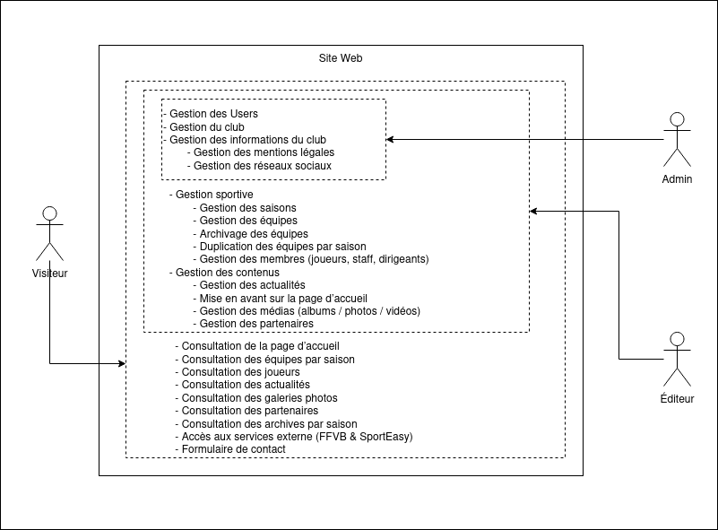

# Cartographie fonctionnelle

> Vue métier / utilisateur
> 

## Acteurs

- Visiteur
- Administrateur
- Editeur
- Système externe (FFVB, SportEasy)

## Domaines fonctionnels

### Site public

- Consultation de la page d’accueil
- Consultation des équipes par saison
- Consultation des joueurs
- Consultation des actualités
- Consultation des galeries photos
- Consultation des partenaires
- Consultation des archives par saison
- Formulaire de contact

### Back-office (administration)

- Gestion du club
    - Gestion des informations du club
    - Gestion des mentions légales
    - Gestion des réseaux sociaux
- Gestion sportive
    - Gestion des saisons
    - Gestion des équipes
    - Archivage des équipes
    - Duplication des équipes par saison
    - Gestion des membres (joueurs, staff, dirigeants)
- Gestion des contenus
    - Gestion des actualités
    - Mise en avant sur la page d’accueil
    - Gestion des médias (albums / photos / vidéos)
    - Gestion des partenaires

### Supervision & automatisation

- Synchronisation des résultats FFVB
- Consultation des classements
- Historisation par saison
- Consultation des statistiques du site
- Sauvegarde des données
- Logs de scraping

### Conformité & sécurité

- Authentification administrateur
- Gestion des rôles
- Protection des routes back-office
- Gestion RGPD (cookies, données personnelles)
- Mentions légales

## Cartographie 

