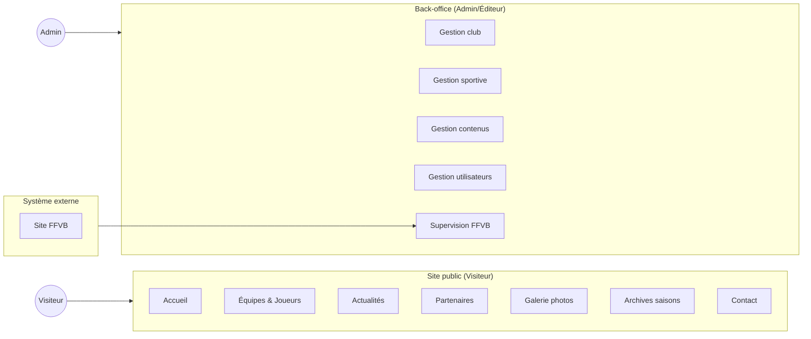
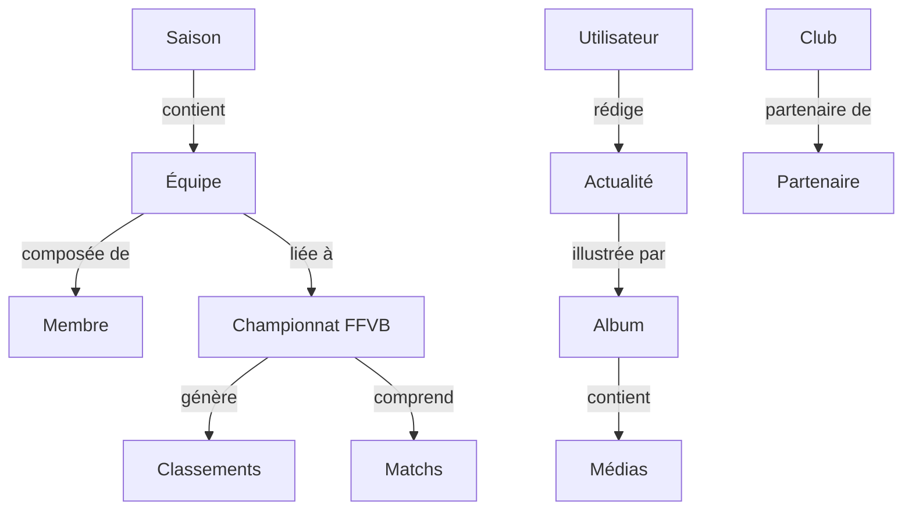

# Cartographie fonctionnelle

> Vue métier — domaines, acteurs et fonctionnalités

---

## Acteurs

| Acteur | Description |
|---|---|
| **Visiteur** | Tout internaute accédant au site public |
| **Administrateur** | Gestionnaire du club — accès complet au back-office |
| **Éditeur** | Contributeur limité (actualités, médias) |
| **Système FFVB** | Site fédéral — source des classements et matchs |

---

## Vue fonctionnelle globale

---

## Domaines fonctionnels détaillés

### Site public

| Fonctionnalité | Description |
|---|---|
| Page d'accueil | Présentation du club, actualités à la une, classements |
| Équipes par saison | Liste filtrée par saison et catégorie |
| Fiche équipe | Effectif, staff, entraînements, classement, matchs |
| Actualités | Liste + détail, filtres |
| Galerie photos | Albums par événement / équipe |
| Partenaires | Liste et fiches partenaires |
| Archives | Consultation des saisons passées |
| Contact | Formulaire d'envoi par email |

---

### Back-office — Gestion du club

| Fonctionnalité | Acteur |
|---|---|
| Modifier informations générales (nom, slogan, description) | Admin |
| Gérer les images (logo, photo principale) | Admin |
| Modifier informations de contact | Admin |
| Gérer les réseaux sociaux | Admin |
| Gérer les mentions légales | Admin |

---

### Back-office — Gestion sportive

| Fonctionnalité | Acteur |
|---|---|
| Créer / modifier / supprimer une saison | Admin |
| Créer / modifier / supprimer une équipe | Admin |
| Archiver une équipe en fin de saison | Admin |
| Dupliquer une équipe vers une nouvelle saison | Admin |
| Ajouter / modifier / supprimer un membre | Admin |
| Associer un membre à une équipe et une saison | Admin |
| Lier une équipe à un championnat FFVB | Admin |

---

### Back-office — Gestion des contenus

| Fonctionnalité | Acteur |
|---|---|
| Créer / modifier / supprimer une actualité | Admin, Éditeur |
| Publier / dépublier une actualité | Admin, Éditeur |
| Mettre une actualité à la une | Admin |
| Créer / gérer des albums photos | Admin, Éditeur |
| Ajouter / supprimer des médias | Admin, Éditeur |
| Ajouter / modifier / supprimer un partenaire | Admin |

---

### Back-office — Gestion des utilisateurs

| Fonctionnalité | Acteur |
|---|---|
| Lister les utilisateurs | Admin |
| Activer / désactiver un compte | Admin |
| Modifier le rôle d'un utilisateur | Admin |
| Supprimer un utilisateur | Admin |

---

### Supervision FFVB & automatisation

| Fonctionnalité | Description |
|---|---|
| Scraping manuel | Déclenchement depuis le dashboard admin |
| Import classements | Récupération des standings FFVB par équipe |
| Import matchs | Récupération du calendrier et résultats |
| Logs scraping | Historique des exécutions (succès / erreur) |
| Historisation | Données liées à la saison pour archivage |

---

## Relations entre domaines

