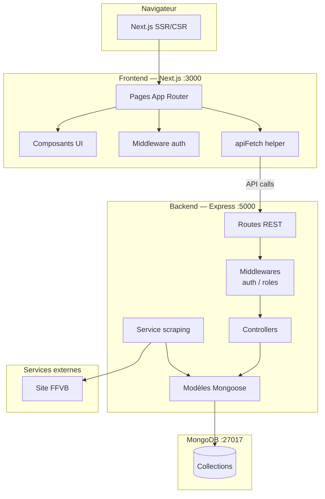
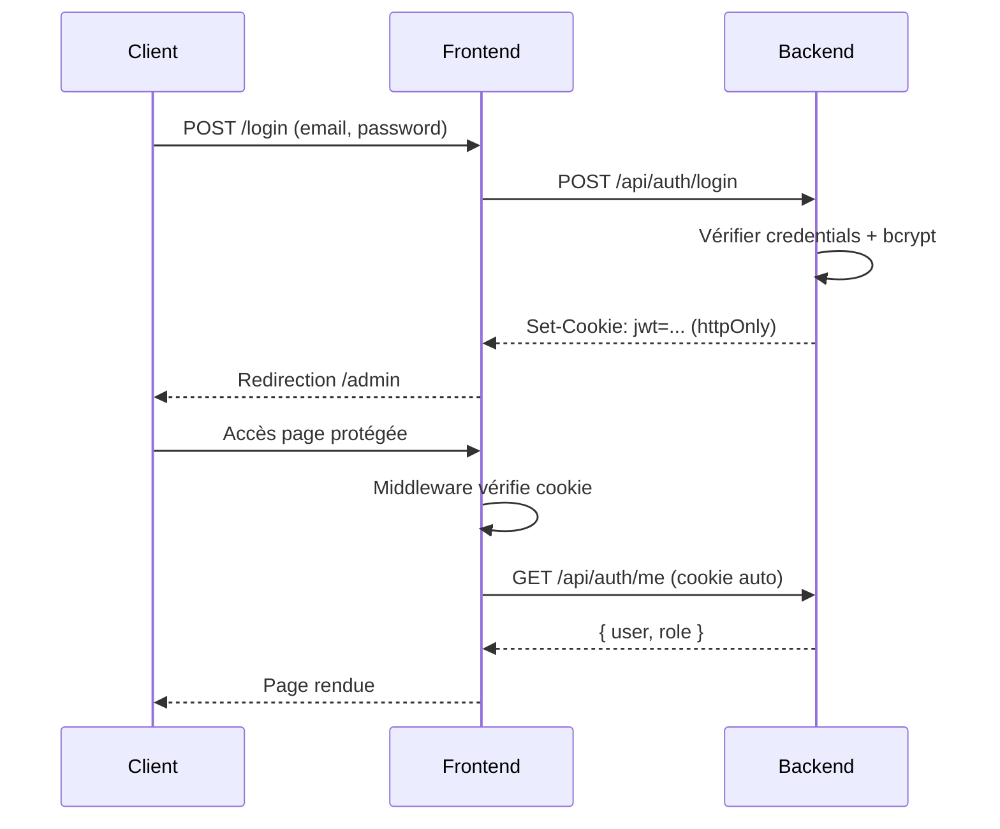

# Cartographie technique

> Vue architecture logicielle — stack et couches applicatives

---

## Stack technique

| Couche | Technologie | Version |
|---|---|---|
| Frontend | Next.js (App Router) | 16.x |
| Langage | TypeScript | 5.x |
| Style | Tailwind CSS | 3.x |
| Composants UI | shadcn/ui | — |
| Backend | Node.js + Express | 20.x / 4.x |
| Base de données | MongoDB + Mongoose | 7.x / 8.x |
| Auth | JWT + Cookie httpOnly | — |
| Scraping | Puppeteer + Cheerio | — |
| Déploiement | Docker + Nginx | — |
| CI/CD | GitHub Actions | — |

---

## Architecture en couches



---

## Frontend — Next.js

### Structure `src/`

```
src/
├── app/                    ← Pages App Router
│   ├── (public)/           ← Pages vitrine
│   ├── admin/              ← Back-office protégé
│   ├── login/
│   ├── register/
│   ├── reset-password/
│   └── verify-email/
├── components/
│   ├── ui/                 ← shadcn/ui
│   ├── dashboard/admin/    ← Composants back-office
│   └── auth/               ← Formulaires auth
└── lib/
    ├── api.ts              ← apiFetch<T> centralisé
    └── auth.ts             ← Types + méthodes authApi
```

### Routing & protection

| Route | Accès | Protection |
|---|---|---|
| `/` | Public | — |
| `/login`, `/register` | Public | — |
| `/admin/*` | Privé | Middleware JWT + rôle admin |

### Variables d'environnement

| Variable | Usage |
|---|---|
| `NEXT_PUBLIC_API_URL` | URL de l'API (build-time) |
| `NEXT_BASE_PATH` | Base path Nginx (`/saintbarth`) |

---

## Backend — Express

### Structure `src/`

```
src/
├── app.js                  ← Configuration Express
├── routes/                 ← Définition des routes REST
├── controllers/            ← Logique métier
├── models/                 ← Schémas Mongoose
├── middlewares/
│   ├── authMiddleware.js   ← Vérification JWT
│   └── requireRole.js      ← Vérification rôle
└── scripts/
    └── seeds/
        ├── seedAdmin.js
        └── seedClub.js
```

### Routes API

| Préfixe | Ressource |
|---|---|
| `/api/auth` | Authentification (login, register, me, logout…) |
| `/api/users` | Gestion utilisateurs |
| `/api/club` | Informations du club |
| `/api/seasons` | Saisons |
| `/api/teams` | Équipes |
| `/api/members` | Membres |
| `/api/news` | Actualités |
| `/api/partners` | Partenaires |
| `/api/championships` | Championnats FFVB |
| `/api/scraping` | Déclenchement scraping |
| `/api/upload` | Upload fichiers |

### Sécurité

| Mécanisme | Implémentation |
|---|---|
| Hash mots de passe | bcrypt (salt 10) |
| Sessions | JWT en cookie httpOnly |
| Autorisation | Middleware `requireRole` |
| Validation | Mongoose schema validation |

---

## Base de données — MongoDB

### Collections

| Collection | Description |
|---|---|
| `users` | Comptes administrateurs et éditeurs |
| `clubs` | Informations du club (singleton) |
| `seasons` | Saisons sportives |
| `teams` | Équipes par saison |
| `members` | Membres (joueurs, staff, dirigeants) |
| `news` | Actualités |
| `albums` | Albums photos |
| `media` | Médias (photos / vidéos) |
| `partners` | Partenaires |
| `championships` | Championnats FFVB associés aux équipes |
| `standings` | Classements FFVB |
| `matches` | Matchs FFVB |
| `scrapinglogs` | Logs des scraping |

---

## Authentification — Flow


