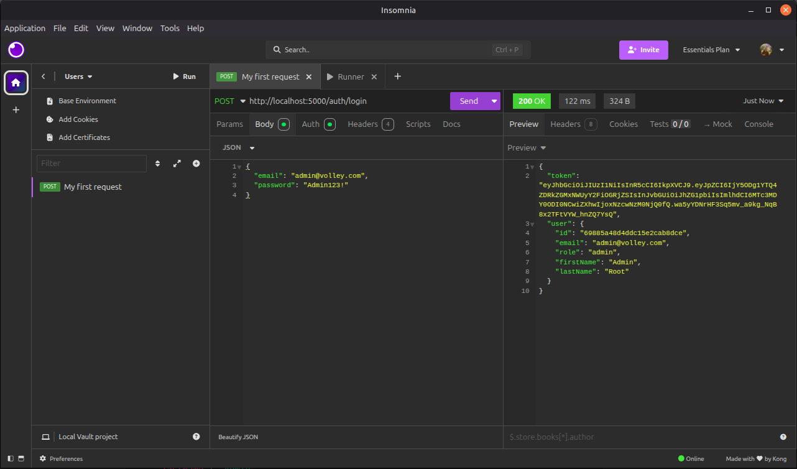
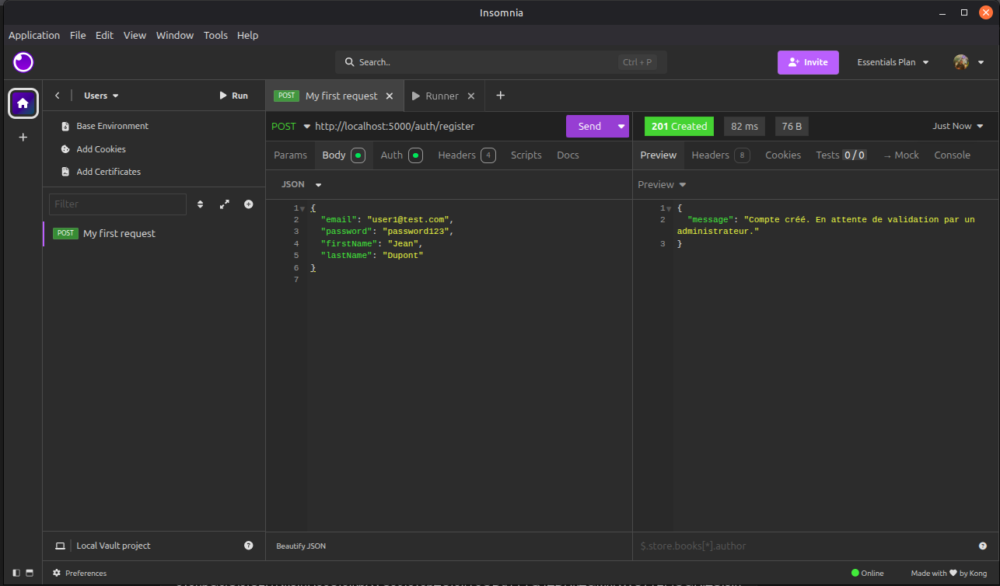
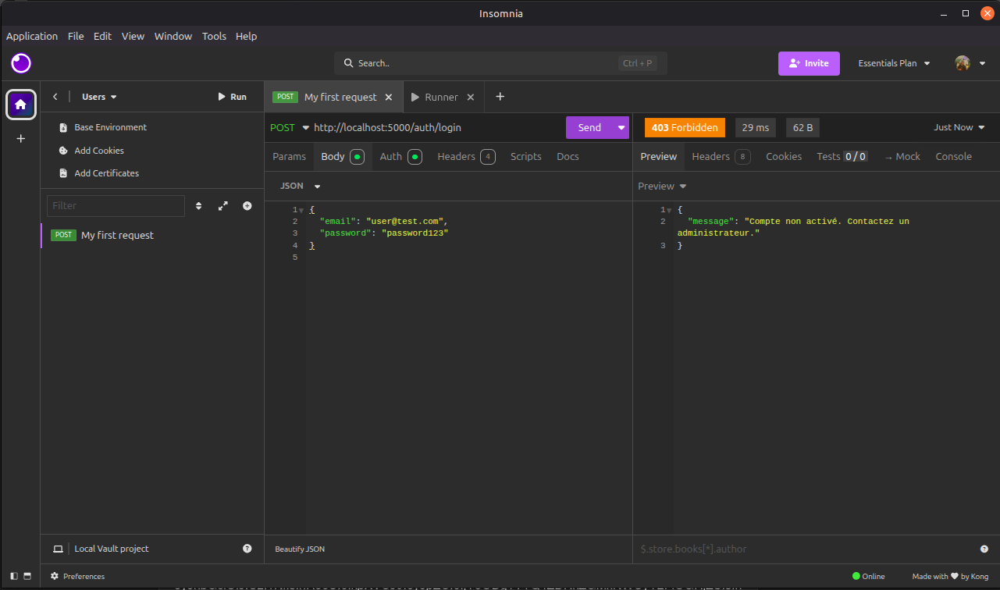
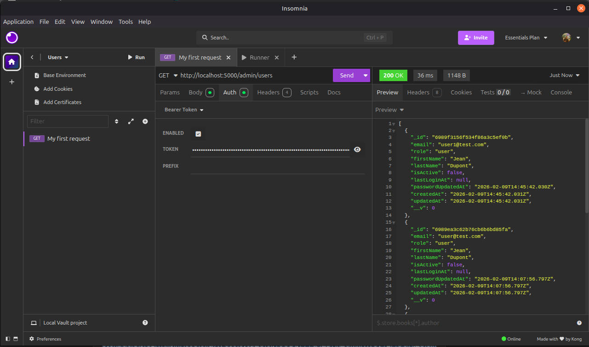
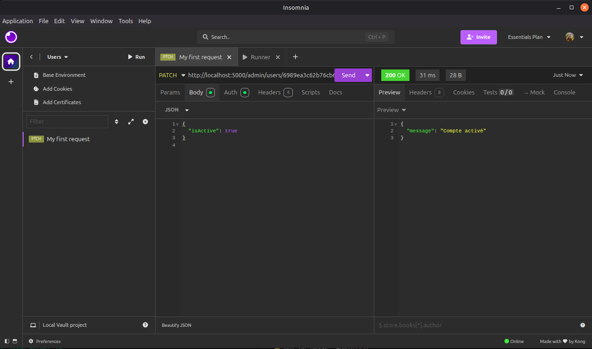
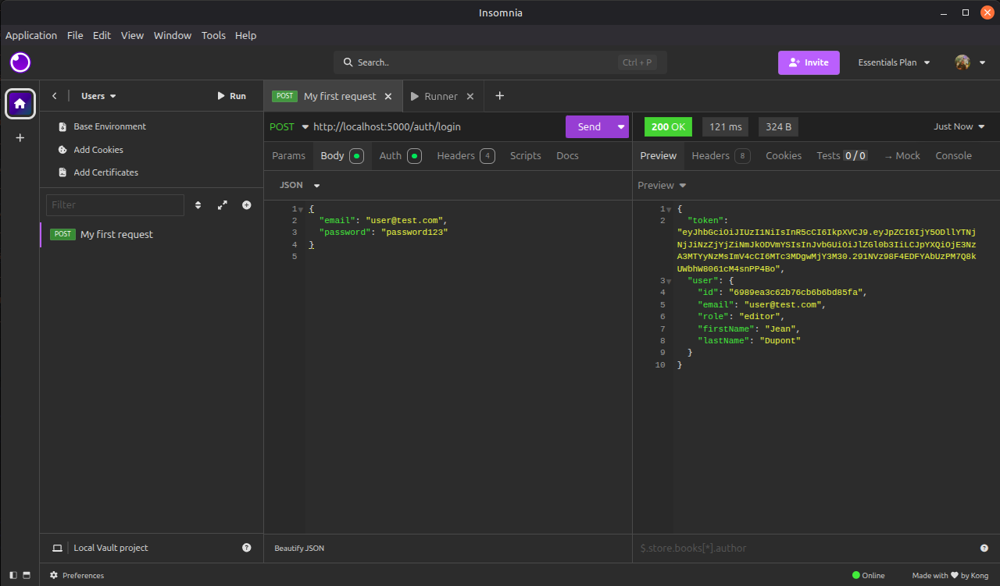
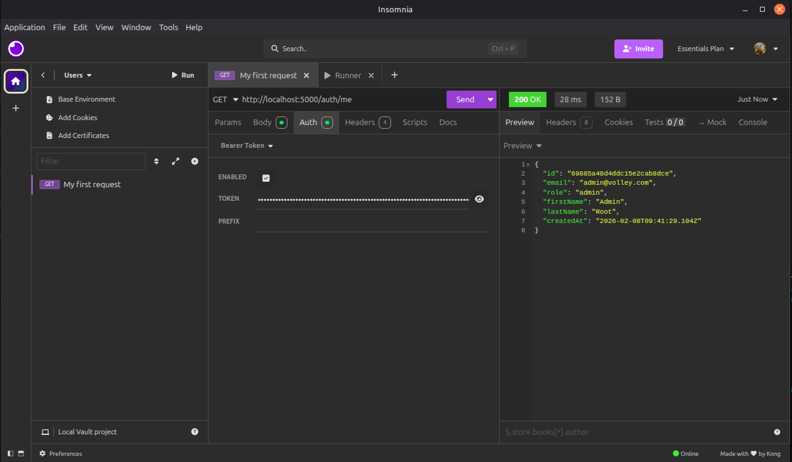

# AUTHENTIFICATION

## Modèle utilisateur (`User`)

Modèle Mongoose `User` contient :

```jsx
{
    email:String,// unique, 
    obligatoirepasswordHash:String,// hash du mot de passe
    role:String,// 'admin', 'editor', 'user', 'other'
    firstName:String,
    lastName:String,
    isActive:Boolean,// false par défaut pour les nouveaux comptes
    lastLoginAt:Date,
    passwordUpdatedAt:Date
}
```

Méthodes intégrées :

- `setPassword(password)` → hash le mot de passe et met à jour `passwordUpdatedAt`
- `comparePassword(password)` → compare le mot de passe avec le hash

## Routes Auth (`/auth`)

| Endpoint | Méthode | Description | Auth requise |
| --- | --- | --- | --- |
| `/register` | POST | Crée un compte utilisateur (inactif par défaut) | ❌ |
| `/login` | POST | Connexion, renvoie JWT si actif | ❌ |
| `/me` | GET | Retourne les infos de l’utilisateur connecté | ✅ |

### Détails `/register`

- Corps JSON : `{ email, password, firstName, lastName }`
- `isActive = false` → compte bloqué jusqu’à validation admin
- Hash du mot de passe avec bcrypt

### Détails `/login`

- Corps JSON : `{ email, password }`
- Vérifie : user existe, compte actif, mot de passe correct
- Renvoie : JWT + infos utilisateur

### Détails `/me`

- Header : `Authorization: Bearer <JWT>`
- Retourne : id, email, role, prénom, nom, date création
- Sert à **savoir qui est connecté**

## Middleware (`authMiddleware.js`)

- `authMiddleware` → vérifie JWT + récupère user + bloque comptes inactifs
- `requireRole(...roles)` → protège routes selon rôle (`admin`, `editor`, etc.)

**Exemple d’utilisation :**

```jsx
router.get('/profile', authMiddleware,(req, res) => res.json(req.user));
router.get('/admin/users', authMiddleware,requireRole('admin'), ...);
```

## Routes Admin (`/admin`)

| Endpoint | Méthode | Description | Auth requise |
| --- | --- | --- | --- |
| `/users` | GET | Liste tous les utilisateurs | ✅ admin |
| `/users/:id/activate` | PATCH | Activer / désactiver un compte | ✅ admin |
| `/users/:id/role` | PATCH | Changer rôle d’un utilisateur | ✅ admin |

## Seed Admin (`seedAdmin.js`)

- Crée un **compte admin actif** si aucun admin n’existe
- Mot de passe hashé
- Variables `.env` :
    
    ```
    ADMIN_EMAIL=admin@volley.com
    ADMIN_PASSWORD=Admin123!
    ```
    
- Lancer :

```bash
node src/scripts/seedAdmin.js
```

## Séquences complètes (auth + admin)

### Inscription

1. User POST `/auth/register`
2. `isActive = false`, rôle = user
3. User ne peut pas se connecter

### Activation

1. Admin se connecte (`/auth/login`)
2. Admin GET `/admin/users` → liste users
3. Admin PATCH `/admin/users/:id/activate` → active compte
4. Optionnel : admin PATCH `/admin/users/:id/role` → change rôle

### Connexion

1. User actif POST `/auth/login`
2. Reçoit JWT + infos
3. Front peut utiliser `/auth/me` pour vérifier session

## Sécurité

- Password **jamais exposé**
- JWT expirant (`1d`)
- Middleware protège routes sensibles
- Rôles (`admin`, `editor`, `user`) pour permissions
- Compte inactif → login interdit

## Tests Postman

1. `POST /auth/login` → admin seed


2. `POST /auth/register` → nouvel utilisateur


3. `POST /auth/login` → user non actif → 403


4. `GET /admin/users` → JWT admin


5. `PATCH /admin/users/:id/activate` → active user


6. `PATCH /admin/users/:id/role` → change rôle


7. `POST /auth/login` → user actif → JWT reçu


8. `GET /auth/me` → récupérer infos utilisateur connecté


## Points d’amélioration futurs

- Validation email + lien activation
- Refresh token pour prolonger session
- Rate limit login pour éviter brute-force
- Front React auth context / Protected routes
- Audit logs admin