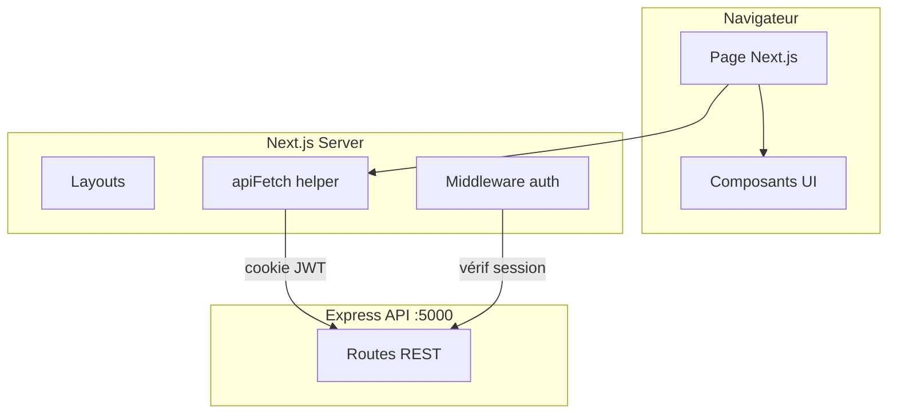

# Frontend — Architecture (Next.js)

> Next.js 16 — App Router — TypeScript — Tailwind CSS — shadcn/ui

---

## Stack

| Technologie | Rôle |
|---|---|
| Next.js 16 (App Router) | Framework React SSR/SSG |
| TypeScript | Typage statique |
| Tailwind CSS | Styles utilitaires |
| shadcn/ui | Composants UI accessibles |
| @tabler/icons-react | Icônes |

---

## Structure `src/`

```
src/
├── app/                            ← Pages App Router
│   ├── layout.tsx                  ← Layout racine
│   ├── page.tsx                    ← Page d'accueil (vitrine)
│   ├── login/page.tsx
│   ├── register/page.tsx
│   ├── forgot-password/page.tsx
│   ├── reset-password/page.tsx
│   ├── verify-email/page.tsx
│   └── admin/                      ← Back-office (protégé)
│       ├── layout.tsx              ← Layout admin (sidebar)
│       ├── page.tsx                ← Dashboard
│       ├── club/page.tsx
│       ├── seasons/
│       │   ├── page.tsx
│       │   └── [seasonId]/teams/
│       │       ├── page.tsx
│       │       └── [teamId]/page.tsx
│       ├── members/page.tsx
│       ├── news/page.tsx
│       ├── partners/page.tsx
│       └── users/page.tsx
├── components/
│   ├── ui/                         ← shadcn/ui (Button, Input, Card…)
│   ├── dashboard/admin/            ← Composants back-office
│   │   ├── app-sidebar.tsx
│   │   ├── nav-main.tsx
│   │   ├── nav-user.tsx
│   │   ├── club-form.tsx
│   │   ├── file-upload.tsx
│   │   └── ...
│   └── auth/                       ← Formulaires auth
│       ├── login-form.tsx
│       ├── register-form.tsx
│       └── ...
└── lib/
    ├── api.ts                      ← apiFetch<T> centralisé
    └── auth.ts                     ← Types AuthUser + authApi
```

---

## Helper API — `src/lib/api.ts`

Toutes les requêtes passent par `apiFetch<T>` :

```ts
export async function apiFetch<T>(
  endpoint: string,
  options: RequestInit = {}
): Promise<T> {
  const res = await fetch(`${API_URL}${endpoint}`, {
    credentials: "include",       // envoie le cookie JWT
    headers: {
      "Content-Type": "application/json",
      ...options.headers,
    },
    ...options,
  });

  if (!res.ok) {
    const error = await res.json();
    throw new Error(error.message || "Erreur API");
  }

  return res.json() as Promise<T>;
}
```

Usage :

```ts
const user = await apiFetch<AuthUser>("/api/auth/me");
const news = await apiFetch<News[]>("/api/news");
```

---

## Types principaux — `src/lib/auth.ts`

```ts
export interface AuthUser {
  _id: string;
  email: string;
  firstName: string;
  lastName: string;
  role: "admin" | "editor" | "user";
  isActive: boolean;
  isVerified: boolean;
}

export interface ApiMessage {
  message: string;
}
```

---

## Variables d'environnement

| Variable | Environnement | Valeur dev | Valeur prod |
|---|---|---|---|
| `NEXT_PUBLIC_API_URL` | Build + Runtime | `http://localhost:5000` | `/saintbarth` |
| `NEXT_BASE_PATH` | Build | — | `/saintbarth` |

---

## Routing & protection

### Structure App Router

| Route | Type | Protection |
|---|---|---|
| `/` | Public | — |
| `/login`, `/register` | Public | — |
| `/forgot-password`, `/reset-password` | Public | — |
| `/verify-email` | Public | — |
| `/admin` | Privé | Middleware JWT + rôle |
| `/admin/*` | Privé | Middleware JWT + rôle |

### Middleware `middleware.ts`

Intercepte toutes les requêtes vers `/admin/*` et vérifie le cookie JWT via `/api/auth/me`.

---

## Architecture globale



---

## Flow d'authentification

```
1. Utilisateur → POST /api/auth/login
2. Backend → Set-Cookie: token=jwt (httpOnly, SameSite)
3. Middleware Next.js → GET /api/auth/me (cookie envoyé auto)
4. Si 200 → accès autorisé
5. Si 401 → redirection /login
```

---

## Lancement en développement

```bash
cd saintBarthVolleyApp/frontend
npm install
npm run dev
```

Frontend disponible sur `http://localhost:3000`

---

## Build de production

```bash
npm run build   # next build
npm start       # next start
```

Les variables `NEXT_BASE_PATH` et `NEXT_PUBLIC_API_URL` doivent être définies au moment du build.
