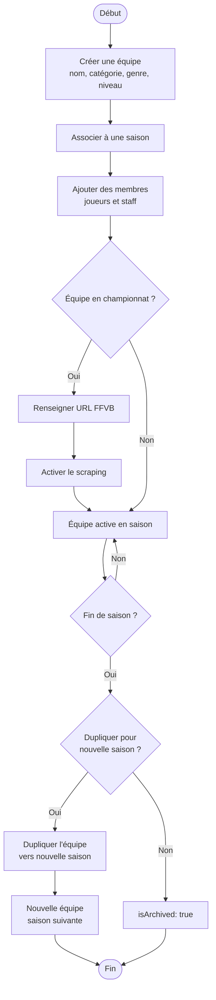
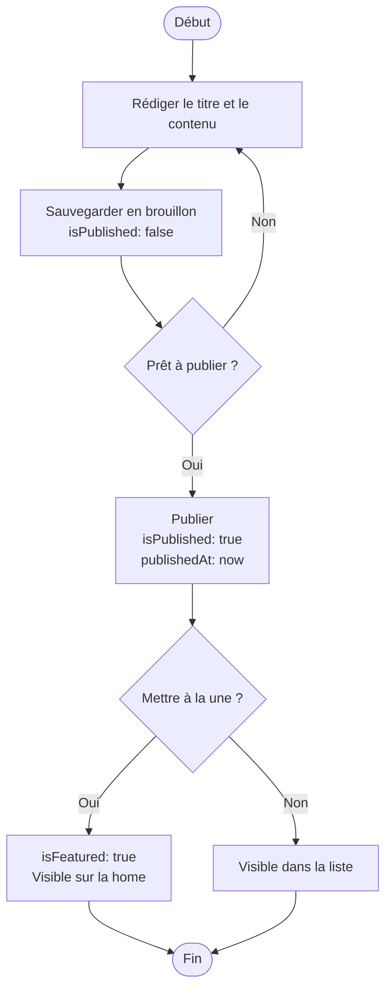
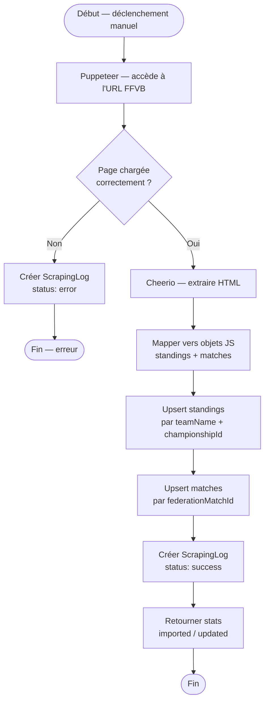
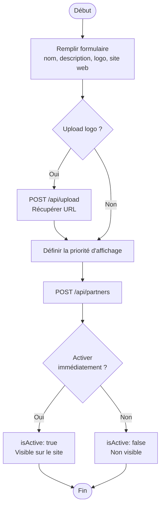
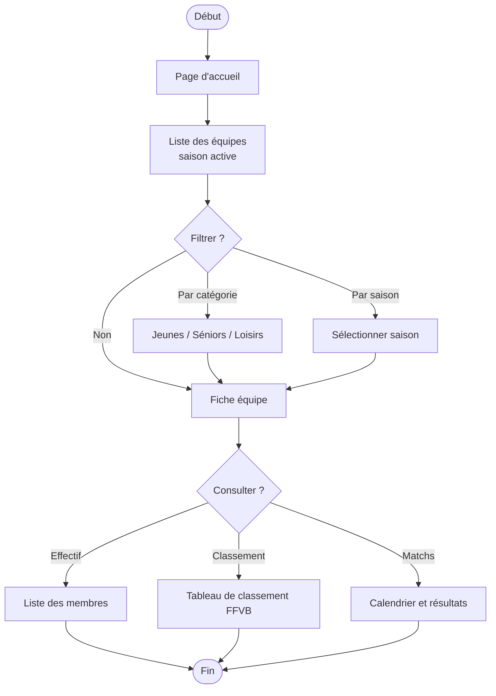

# UML — Diagrammes d'activité

---

## 1. Connexion administrateur

```mermaid
flowchart TD
    START([Début]) --> FORM[Saisir email et mot de passe]
    FORM --> SUBMIT[Soumettre le formulaire]
    SUBMIT --> CHECK_CRED{Identifiants valides ?}
    CHECK_CRED -->|Non| ERR1[Afficher message d'erreur]
    ERR1 --> FORM
    CHECK_CRED -->|Oui| CHECK_ACTIVE{Compte actif ?}
    CHECK_ACTIVE -->|Non| ERR2[Afficher "Compte inactif"]
    ERR2 --> END_ERR([Fin])
    CHECK_ACTIVE -->|Oui| JWT[Générer JWT + cookie httpOnly]
    JWT --> REDIRECT[Rediriger vers /admin]
    REDIRECT --> END([Fin])
```

---

## 2. Inscription utilisateur

```mermaid
flowchart TD
    START([Début]) --> FORM[Remplir formulaire<br/>prénom, nom, email, mot de passe]
    FORM --> VAL_PWD{Mot de passe<br/>conforme ?}
    VAL_PWD -->|Non| ERR_PWD[Afficher règles mot de passe]
    ERR_PWD --> FORM
    VAL_PWD -->|Oui| CHECK_EMAIL{Email déjà utilisé ?}
    CHECK_EMAIL -->|Oui| ERR_EMAIL[Afficher "Email déjà utilisé"]
    ERR_EMAIL --> FORM
    CHECK_EMAIL -->|Non| CREATE[Créer compte<br/>isActive: false<br/>isVerified: false]
    CREATE --> EMAIL[Envoyer email de vérification]
    EMAIL --> MSG[Afficher "Vérifiez votre email"]
    MSG --> VERIFY{Utilisateur clique<br/>le lien ?}
    VERIFY -->|Oui| VERIFIED[isVerified: true]
    VERIFIED --> WAIT[Attendre activation par admin]
    WAIT --> ACTIVATED{Admin active<br/>le compte ?}
    ACTIVATED -->|Oui| ACTIVE[isActive: true]
    ACTIVE --> END([Fin — compte opérationnel])
    ACTIVATED -->|Non| END_REF([Fin — accès refusé])
```

---

## 3. Gestion d'une équipe (cycle complet)



---

## 4. Publication d'une actualité



---

## 5. Scraping FFVB



---

## 6. Ajout d'un partenaire



---

## 7. Navigation visiteur — Consultation équipes


