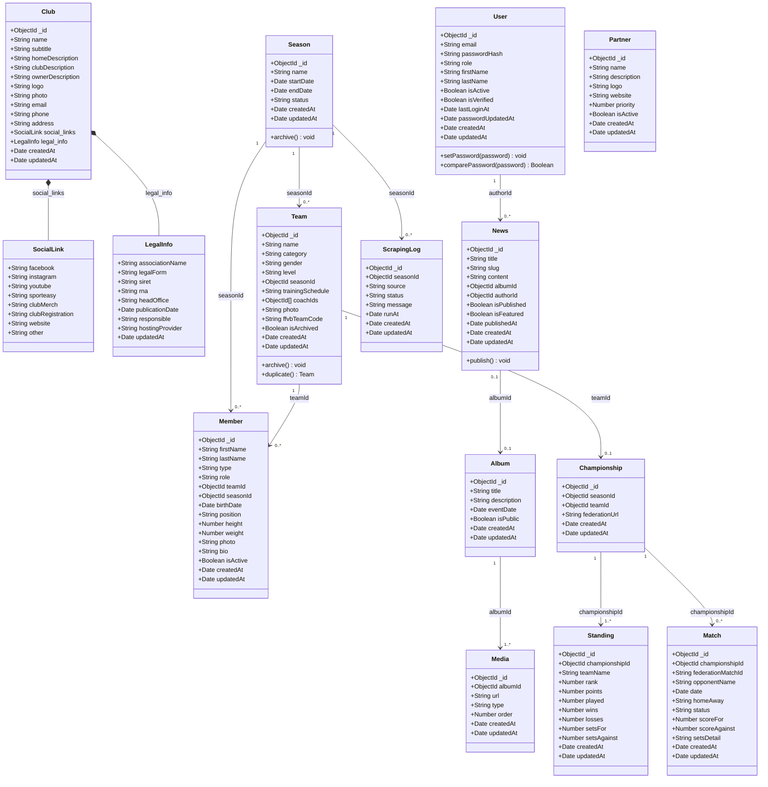
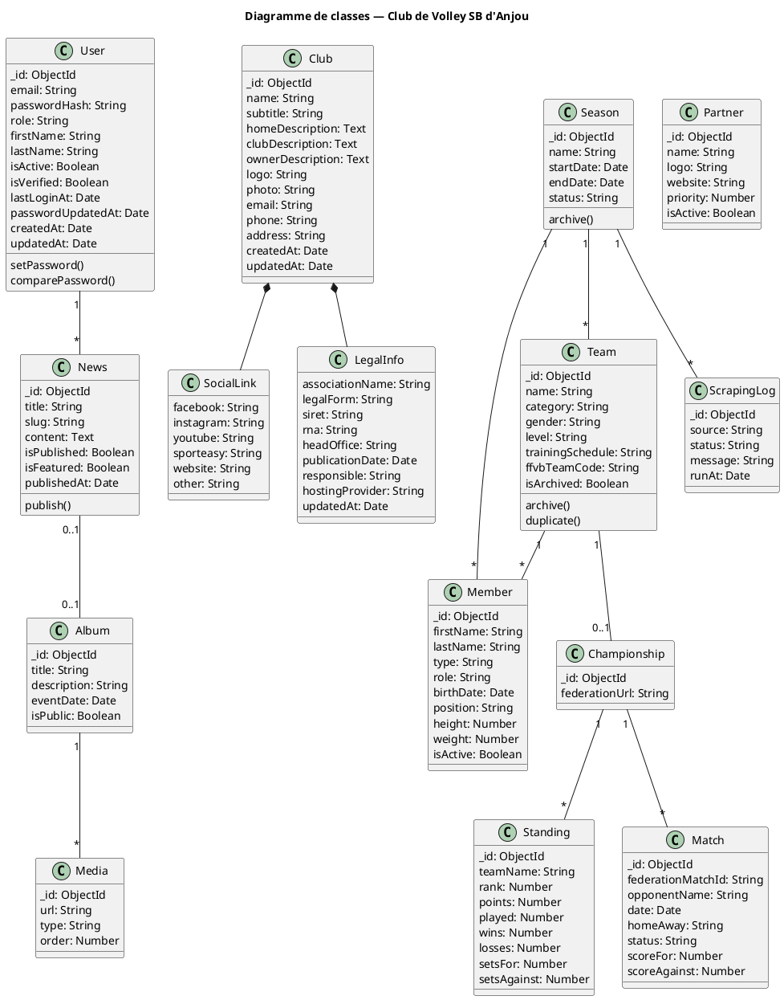

# UML — Diagramme de classes

---

## Vue d'ensemble des classes

---

## Relations clés

| Relation | Type | Cardinalité |
|---|---|---|
| `Club` ◆─ `SocialLink` | Composition (embedded) | 1 — 1 |
| `Club` ◆─ `LegalInfo` | Composition (embedded) | 1 — 1 |
| `Season` → `Team` | Référence (seasonId) | 1 — 0..* |
| `Season` → `Member` | Référence (seasonId) | 1 — 0..* |
| `Team` → `Member` | Référence (teamId) | 1 — 0..* |
| `Team` → `Championship` | Référence (teamId) | 1 — 0..1 |
| `Championship` → `Standing` | Référence (championshipId) | 1 — 1..* |
| `Championship` → `Match` | Référence (championshipId) | 1 — 0..* |
| `User` → `News` | Référence (authorId) | 1 — 0..* |
| `News` → `Album` | Référence optionnelle (albumId) | 0..1 — 0..1 |
| `Album` → `Media` | Référence (albumId) | 1 — 1..* |
| `Season` → `ScrapingLog` | Référence (seasonId) | 1 — 0..* |

---

## Énumérations

### User.role
- `admin` — accès complet
- `editor` — gestion des contenus
- `user` — compte standard (non utilisé en back-office)

### Season.status
- `active` — saison en cours
- `archived` — saison terminée
- `future` — saison à venir

### Member.type
- `player` — joueur
- `staff` — entraîneur / encadrement
- `dirigeant` — dirigeant du club
- `benevole` — bénévole

### Match.homeAway
- `home` — à domicile
- `away` — à l'extérieur

### Match.status
- `scheduled` — match à venir
- `played` — match joué

---

## PlantUML — Source (pour génération PNG)

