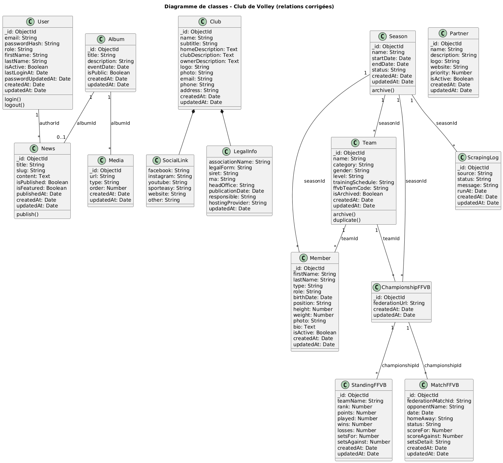

## Classes principales du système

### Cœur du système

- User
- Club
- Season
- Team
- Member

### Contenus

- News
- Album
- Media
- Partner

### FFVB / Automatisation

- ChampionshipFFVB
- StandingFFVB
- MatchFFVB
- ScrapingLog

### Objets embarqués (composition)

- SocialLink
- LegalInfo

## Relations clés (vue globale)

| Relation | Type |
| --- | --- |
| Club ◼─ SocialLink | Composition |
| Club ◼─ LegalInfo | Composition |
| Season ─ Team | 1 → * |
| Team ─ Member | 1 → * |
| User ─ News | 1 → * |
| Album ─ Media | 1 → * |
| Team ─ ChampionshipFFVB | 1 → 1 |
| ChampionshipFFVB ─ StandingFFVB | 1 → * |
| ChampionshipFFVB ─ MatchFFVB | 1 → * |
| Season ─ ScrapingLog | 1 → * |

## Diagramme de classes UML (PlantUML)

[UML](/docs/uml/images/)




```
@startuml
title Diagramme de classes - Club de Volley (relations corrigées)

class User {
  _id: ObjectId
  email: String
  passwordHash: String
  role: String
  firstName: String
  lastName: String
  isActive: Boolean
  lastLoginAt: Date
  passwordUpdatedAt: Date
  createdAt: Date
  updatedAt: Date

  login()
  logout()
}

class Club {
  _id: ObjectId
  name: String
  subtitle: String
  homeDescription: Text
  clubDescription: Text
  ownerDescription: Text
  logo: String
  photo: String
  email: String
  phone: String
  address: String
  createdAt: Date
  updatedAt: Date
}

class SocialLink {
  facebook: String
  instagram: String
  youtube: String
  sporteasy: String
  website: String
  other: String
}

class LegalInfo {
  associationName: String
  legalForm: String
  siret: String
  rna: String
  headOffice: String
  publicationDate: Date
  responsible: String
  hostingProvider: String
  updatedAt: Date
}

class Season {
  _id: ObjectId
  name: String
  startDate: Date
  endDate: Date
  status: String
  createdAt: Date
  updatedAt: Date

  archive()
}

class Team {
  _id: ObjectId
  name: String
  category: String
  gender: String
  level: String
  trainingSchedule: String
  ffvbTeamCode: String
  isArchived: Boolean
  createdAt: Date
  updatedAt: Date

  archive()
  duplicate()
}

class Member {
  _id: ObjectId
  firstName: String
  lastName: String
  type: String
  role: String
  birthDate: Date
  position: String
  height: Number
  weight: Number
  photo: String
  bio: Text
  isActive: Boolean
  createdAt: Date
  updatedAt: Date
}

class News {
  _id: ObjectId
  title: String
  slug: String
  content: Text
  isPublished: Boolean
  isFeatured: Boolean
  publishedAt: Date
  createdAt: Date
  updatedAt: Date

  publish()
}

class Album {
  _id: ObjectId
  title: String
  description: String
  eventDate: Date
  isPublic: Boolean
  createdAt: Date
  updatedAt: Date
}

class Media {
  _id: ObjectId
  url: String
  type: String
  order: Number
  createdAt: Date
  updatedAt: Date
}

class Partner {
  _id: ObjectId
  name: String
  description: String
  logo: String
  website: String
  priority: Number
  isActive: Boolean
  createdAt: Date
  updatedAt: Date
}

class ChampionshipFFVB {
  _id: ObjectId
  federationUrl: String
  createdAt: Date
  updatedAt: Date
}

class StandingFFVB {
  _id: ObjectId
  teamName: String
  rank: Number
  points: Number
  played: Number
  wins: Number
  losses: Number
  setsFor: Number
  setsAgainst: Number
  createdAt: Date
  updatedAt: Date
}

class MatchFFVB {
  _id: ObjectId
  federationMatchId: String
  opponentName: String
  date: Date
  homeAway: String
  status: String
  scoreFor: Number
  scoreAgainst: Number
  setsDetail: String
  createdAt: Date
  updatedAt: Date
}

class ScrapingLog {
  _id: ObjectId
  source: String
  status: String
  message: String
  runAt: Date
  createdAt: Date
  updatedAt: Date
}

' Compositions
Club *-- SocialLink
Club *-- LegalInfo

' Relations référencées
Season "1" -- "*" Team : seasonId
Team "1" -- "*" Member : teamId
Season "1" -- "*" Member : seasonId

User "1" -- "*" News : authorId
Album "1" -- "*" Media : albumId
Album "1" -- "0..1" News : albumId

Season "1" -- "*" ChampionshipFFVB : seasonId
Team "1" -- "*" ChampionshipFFVB : teamId

ChampionshipFFVB "1" -- "*" StandingFFVB : championshipId
ChampionshipFFVB "1" -- "*" MatchFFVB : championshipId

Season "1" -- "*" ScrapingLog : seasonId

@enduml

```