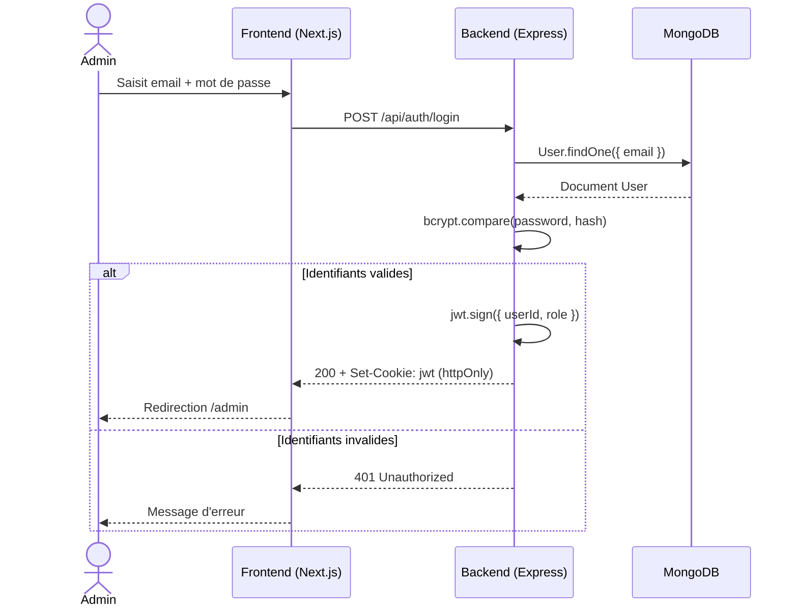
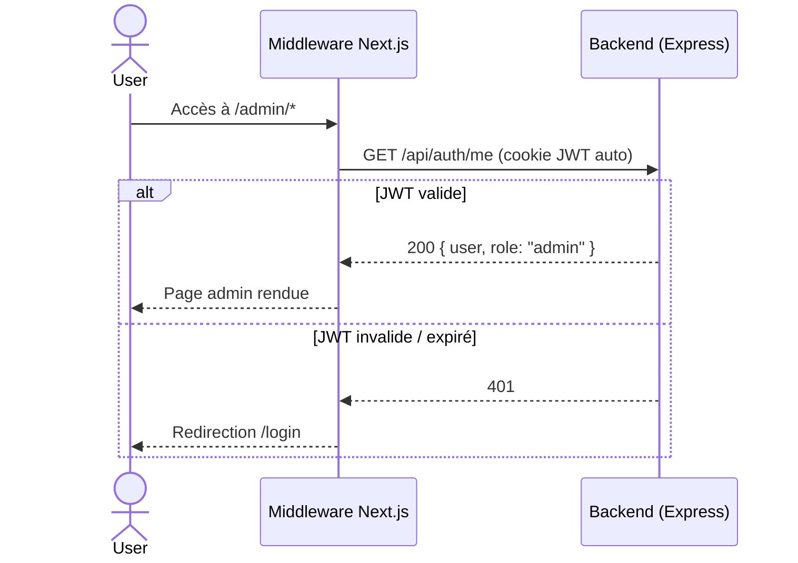
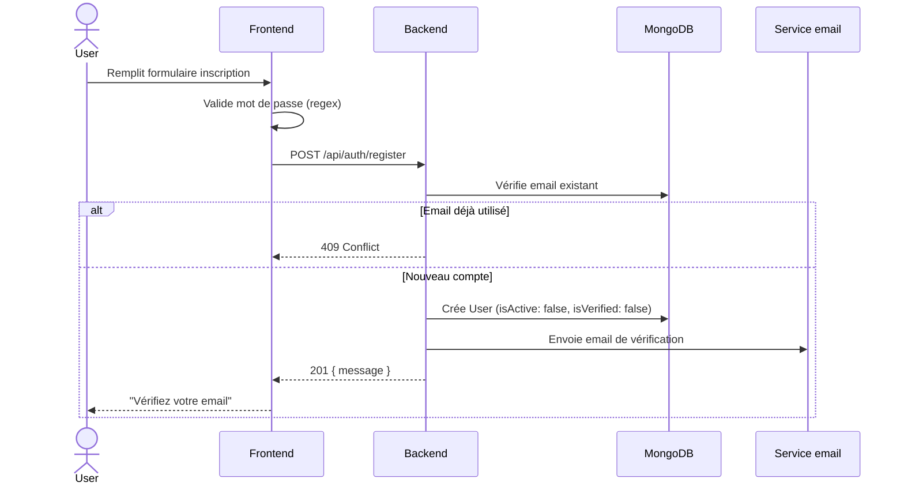
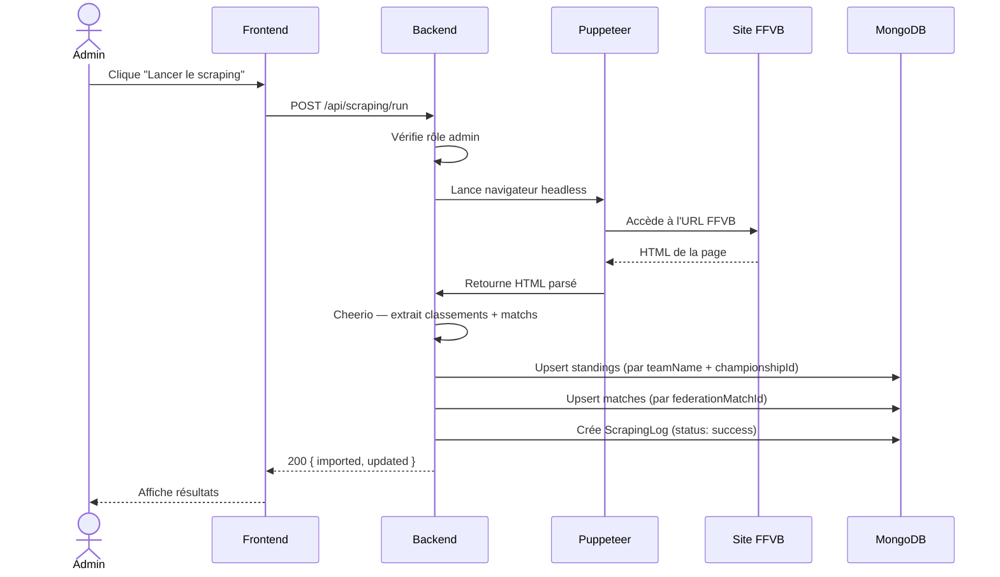
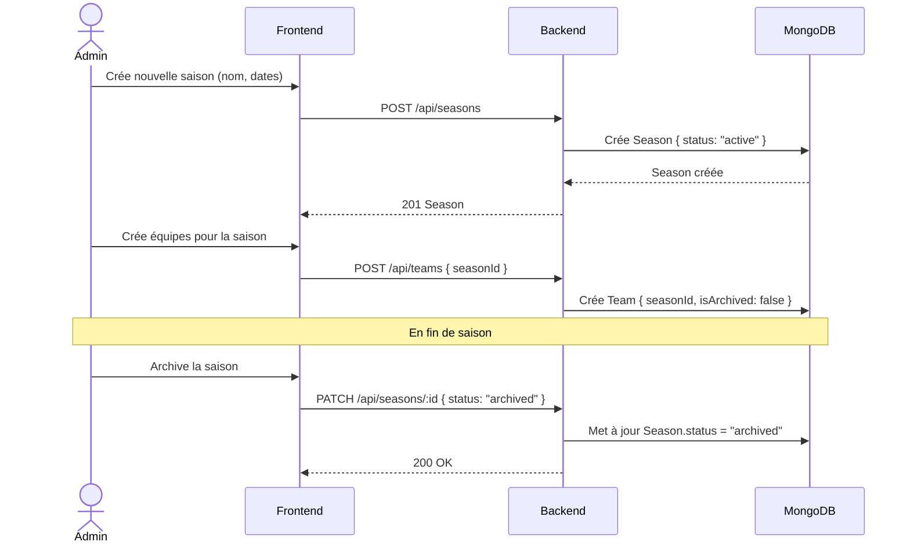
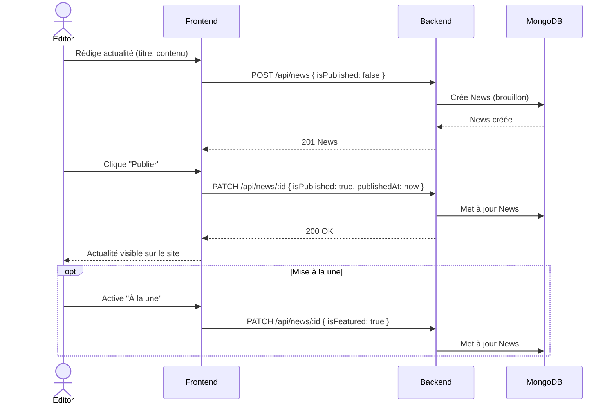
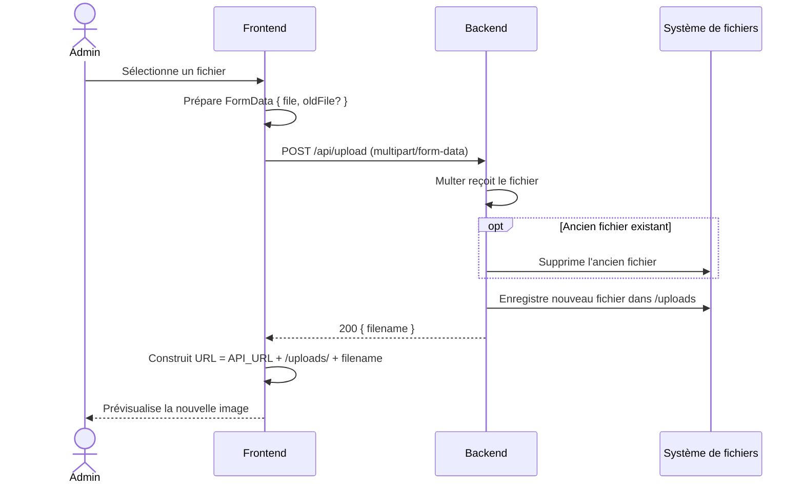

# UML — Diagrammes de séquence

---

## 1. Authentification — Connexion administrateur

---

## 2. Authentification — Vérification de session

---

## 3. Inscription utilisateur

---

## 4. Scraping FFVB

---

## 5. Gestion d'une saison — Création et archivage

---

## 6. Publication d'une actualité

---

## 7. Upload d'un fichier (logo / photo)

