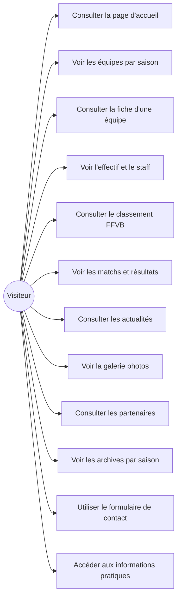
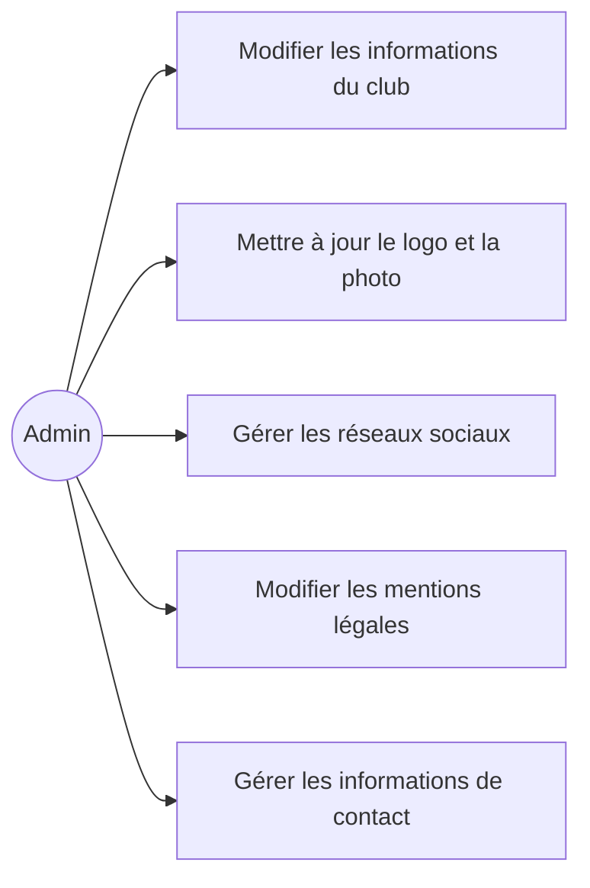
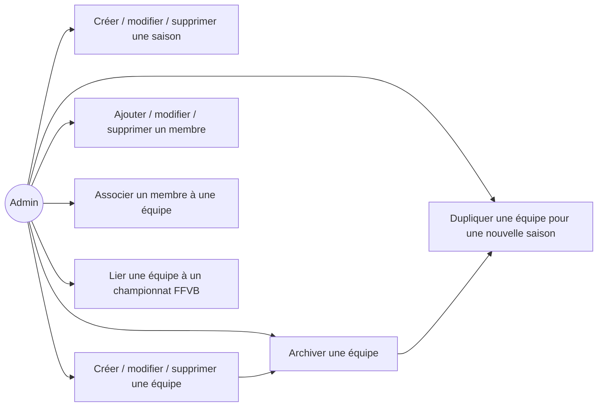
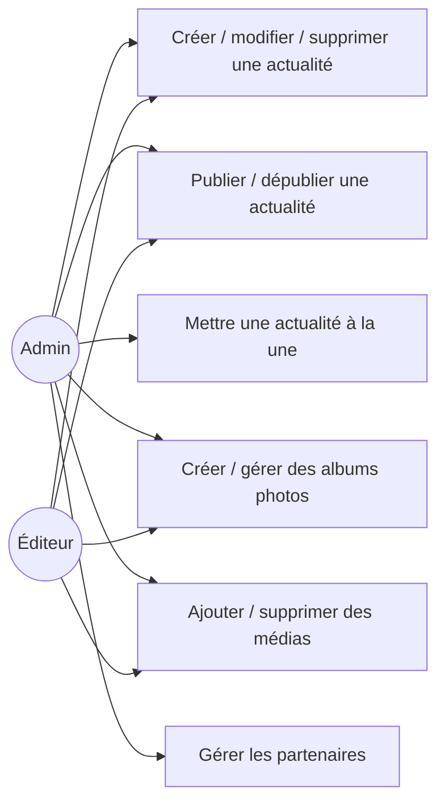
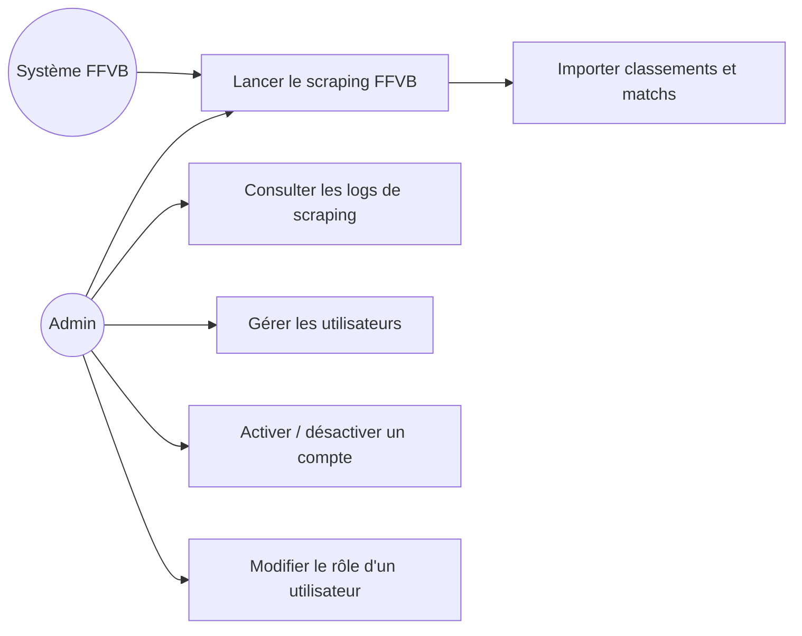
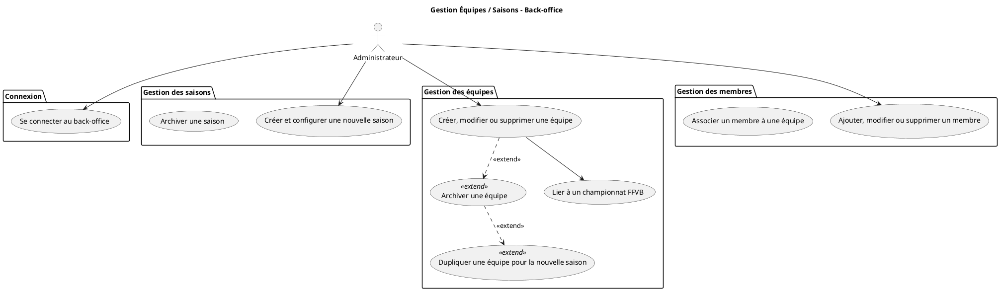

# UML — Diagrammes de cas d'utilisation

---

## Acteurs

| Acteur | Rôle |
|---|---|
| **Visiteur** | Tout internaute — accès au site public uniquement |
| **Administrateur** | Gestion complète via le back-office |
| **Éditeur** | Gestion des contenus (actualités, médias) |
| **Système FFVB** | Source de données sportives externes |

---

## Cas d'utilisation — Visiteur (site public)

---

## Cas d'utilisation — Administrateur (back-office)

### Gestion du club

### Gestion sportive

### Gestion des contenus

### Supervision et utilisateurs

---

## PlantUML — Source diagramme visiteur

Les images dans [./images/](./images/) ont été générées avec PlantUML.

```plantuml
@startuml
title Pages publiques - Club de Volley SB d'Anjou

actor Visiteur

package "Accueil & Informations" {
  (Consulter la page d'accueil)
  (Voir les informations pratiques)
  (Utiliser le formulaire de contact)
}

package "Équipes & Joueurs" {
  (Consulter la liste des équipes)
  (Voir les détails d'une équipe)
  (Consulter la fiche d'un membre)
  (Filtrer par catégorie ou saison)
}

package "Actualités & Médias" {
  (Consulter les actualités)
  (Voir la galerie photos)
  (Consulter les archives par saison)
}

package "Résultats FFVB" {
  (Voir le classement d'une équipe)
  (Consulter les matchs et résultats)
}

package "Partenaires" {
  (Voir la liste des partenaires)
  (Consulter la fiche d'un partenaire)
}

Visiteur --> (Consulter la page d'accueil)
Visiteur --> (Voir les informations pratiques)
Visiteur --> (Utiliser le formulaire de contact)
Visiteur --> (Consulter la liste des équipes)
Visiteur --> (Voir les détails d'une équipe)
Visiteur --> (Consulter la fiche d'un membre)
Visiteur --> (Filtrer par catégorie ou saison)
Visiteur --> (Consulter les actualités)
Visiteur --> (Voir la galerie photos)
Visiteur --> (Consulter les archives par saison)
Visiteur --> (Voir le classement d'une équipe)
Visiteur --> (Consulter les matchs et résultats)
Visiteur --> (Voir la liste des partenaires)
Visiteur --> (Consulter la fiche d'un partenaire)

@enduml
```

---

## PlantUML — Source diagramme back-office (Équipes/Saisons)

