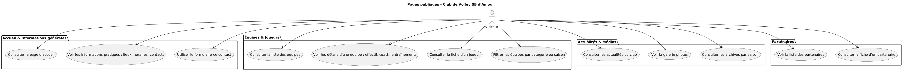
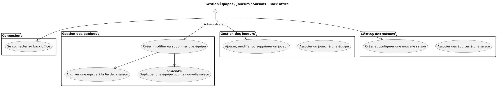
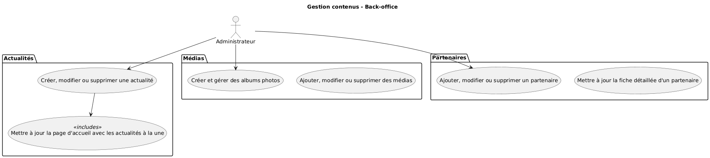
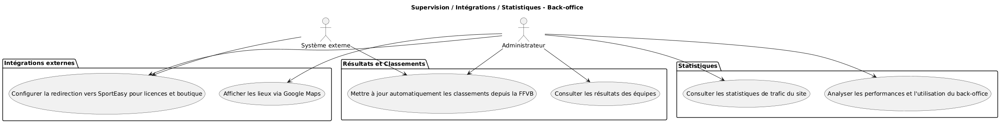

# UML - Diagramme d'utilisation 

## Identification des acteurs

Dans ton projet, on peut identifier au moins ces acteurs :

1. Visiteur / Public
   - Consulte le site web, les équipes, les actualités, la galerie, les partenaires.
   - Accède aux informations pratiques (contacts, lieux, horaires).

2. Administrateur / Équipe du club
   - Gestion complète du site via le back-office.
   - Ajoute / modifie / supprime : équipes, joueurs, saisons, actualités, partenaires, médias.
   - Archive et duplique les saisons.
   - Planifie les tâches automatiques (scraping résultats FFVB).
3. Système externe (optionnel, pour l’UML si tu veux montrer les intégrations)
   - FFVB (scraping résultats et classement)
   - SportEasy (redirection vers boutique et licences)
   - Google Maps (affichage des lieux)

## Cas d’utilisation principaux

Voici une première liste des cas d’utilisation regroupés par acteur :

### Visiteur

- Consulter la page d’accueil
- Consulter les équipes
- Consulter les joueurs
- Consulter les actualités
- Consulter la galerie photo
- Consulter les partenaires
- Consulter les archives par saison
- Utiliser le formulaire de contact

### Administrateur

- Se connecter au back-office
- Gérer les équipes
- Ajouter / modifier / supprimer / archiver / dupliquer
- Gérer les joueurs
- Gérer les saisons
- Gérer les actualités
- Publier / mettre en avant / supprimer
- Gérer les médias et albums
- Gérer les partenaires
- Superviser les résultats et classements (scraping automatique)
- Configurer intégrations externes (SportEasy, Google Maps)
- Consulter statistiques / analytics
- Système externe
- Fournir les résultats FFVB
- Fournir données pour Google Maps
- Fournir liens vers SportEasy

## Relations importantes

Certains cas d’utilisation sont inclus ou étendent d’autres :
- Archiver une équipe → étendu par « Dupliquer une équipe ».
- Publier actualité → inclus « Mettre à jour la page d’accueil ».

Les cas « consulter » sont généralement accessibles à tous les visiteurs.

## Diagramme UML d’utilisation

[UML](/docs/uml/images/)

### Pages publiques (Visiteur)



```
@startuml
title Pages publiques - Club de Volley SB d'Anjou

actor Visiteur

package "Accueil & Informations générales" {
  (Consulter la page d'accueil)
  (Voir les informations pratiques : lieux, horaires, contacts)
  (Utiliser le formulaire de contact)
}

package "Équipes & Joueurs" {
  (Consulter la liste des équipes)
  (Voir les détails d'une équipe : effectif, coach, entraînements)
  (Consulter la fiche d'un joueur)
  (Filtrer les équipes par catégorie ou saison)
}

package "Actualités & Médias" {
  (Consulter les actualités du club)
  (Voir la galerie photos)
  (Consulter les archives par saison)
}

package "Partenaires" {
  (Voir la liste des partenaires)
  (Consulter la fiche d'un partenaire)
}

' Relations acteur -> cas
Visiteur --> (Consulter la page d'accueil)
Visiteur --> (Voir les informations pratiques : lieux, horaires, contacts)
Visiteur --> (Utiliser le formulaire de contact)

Visiteur --> (Consulter la liste des équipes)
Visiteur --> (Voir les détails d'une équipe : effectif, coach, entraînements)
Visiteur --> (Consulter la fiche d'un joueur)
Visiteur --> (Filtrer les équipes par catégorie ou saison)

Visiteur --> (Consulter les actualités du club)
Visiteur --> (Voir la galerie photos)
Visiteur --> (Consulter les archives par saison)

Visiteur --> (Voir la liste des partenaires)
Visiteur --> (Consulter la fiche d'un partenaire)

@enduml

```

### Gestion Équipes / Joueurs / Saisons (Back-office)



```
@startuml
title Gestion Équipes / Joueurs / Saisons - Back-office

actor Administrateur

package "Connexion" {
  (Se connecter au back-office)
}

package "Gestion des équipes" {
  (Créer, modifier ou supprimer une équipe)
  (Archiver une équipe à la fin de la saison)
  (Dupliquer une équipe pour la nouvelle saison) <<extends>>
}

package "Gestion des joueurs" {
  (Ajouter, modifier ou supprimer un joueur)
  (Associer un joueur à une équipe)
}

package "Gestion des saisons" {
  (Créer et configurer une nouvelle saison)
  (Associer des équipes à une saison)
}

' Relations acteur -> cas
Administrateur --> (Se connecter au back-office)

Administrateur --> (Créer, modifier ou supprimer une équipe)
Administrateur --> (Ajouter, modifier ou supprimer un joueur)
Administrateur --> (Créer et configurer une nouvelle saison)

' Relations internes
(Créer, modifier ou supprimer une équipe) --> (Archiver une équipe à la fin de la saison)
(Créer, modifier ou supprimer une équipe) --> (Dupliquer une équipe pour la nouvelle saison)

@enduml
```

### Gestion contenus (Actualités, Médias, Partenaires)



```
@startuml
title Gestion contenus - Back-office

actor Administrateur

package "Actualités" {
  (Créer, modifier ou supprimer une actualité)
  (Mettre à jour la page d'accueil avec les actualités à la une) <<includes>>
}

package "Médias" {
  (Créer et gérer des albums photos)
  (Ajouter, modifier ou supprimer des médias)
}

package "Partenaires" {
  (Ajouter, modifier ou supprimer un partenaire)
  (Mettre à jour la fiche détaillée d'un partenaire)
}

' Relations acteur -> cas
Administrateur --> (Créer, modifier ou supprimer une actualité)
Administrateur --> (Créer et gérer des albums photos)
Administrateur --> (Ajouter, modifier ou supprimer un partenaire)

' Relations internes
(Créer, modifier ou supprimer une actualité) --> (Mettre à jour la page d'accueil avec les actualités à la une)

@enduml

```

### Supervision / Intégrations / Statistiques



```
@startuml
title Supervision / Intégrations / Statistiques - Back-office

actor Administrateur
actor "Système externe" as Systeme

package "Résultats et Classements" {
  (Consulter les résultats des équipes)
  (Mettre à jour automatiquement les classements depuis la FFVB)
}

package "Intégrations externes" {
  (Configurer la redirection vers SportEasy pour licences et boutique)
  (Afficher les lieux via Google Maps)
}

package "Statistiques" {
  (Consulter les statistiques de trafic du site)
  (Analyser les performances et l'utilisation du back-office)
}

' Relations acteur -> cas
Administrateur --> (Consulter les résultats des équipes)
Administrateur --> (Mettre à jour automatiquement les classements depuis la FFVB)
Administrateur --> (Configurer la redirection vers SportEasy pour licences et boutique)
Administrateur --> (Afficher les lieux via Google Maps)
Administrateur --> (Consulter les statistiques de trafic du site)
Administrateur --> (Analyser les performances et l'utilisation du back-office)

' Relations système externe -> cas
Systeme --> (Mettre à jour automatiquement les classements depuis la FFVB)
Systeme --> (Configurer la redirection vers SportEasy pour licences et boutique)

@enduml

```