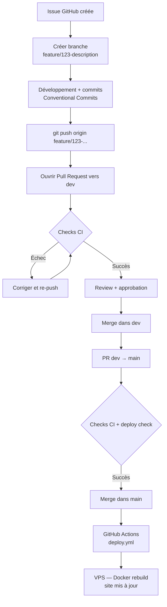

# Workflow — Organisation du développement

---

## Objectifs

- Branches cohérentes et traçables
- Issues liées à chaque tâche
- Commits formatés (Conventional Commits)
- Pull Requests contrôlées avec checks CI
- Déploiement automatique sur `main`

---

## Modèle de branches

```
main          ← Production (déploiement auto)
 └── dev      ← Intégration
      └── feature/123-description  ← Développement
      └── fix/456-description
      └── hotfix/789-description
```

| Branche | Cible | Description |
|---|---|---|
| `feature/*` | `dev` | Nouvelle fonctionnalité |
| `fix/*` | `dev` | Correction de bug |
| `feat/*` | `dev` | Alias pour feature |
| `hotfix/*` | `main` | Correction urgente en production |
| `release/*` | `main` | Préparation d'une release versionnée |
| `dev` | `main` | Branche d'intégration |

### Règles

- Aucun push direct sur `main` ou `dev`
- Tout changement passe par une **Pull Request**
- 1 issue = 1 branche = 1 PR

---

## Convention de commits

Format obligatoire :

```
type(scope): Fixes #<issue> - message
```

### Types autorisés

| Type | Usage |
|---|---|
| `feat` | Nouvelle fonctionnalité |
| `fix` | Correction de bug |
| `docs` | Documentation uniquement |
| `chore` | Maintenance, config, CI |
| `refactor` | Refactoring sans changement fonctionnel |
| `test` | Tests |
| `hotfix` | Correction urgente |

### Exemples valides

```
feat(auth): Fixes #12 - Ajout page de connexion
fix(api): Fixes #34 - Correction timeout scraping
docs(readme): Fixes #5 - Mise à jour installation
chore(ci): Fixes #67 - Correction workflow deploy
hotfix(prod): Fixes #89 - Correction crash login
```

### Exceptions (sans numéro d'issue)

```
chore(ci): message
docs(readme): message
fix(ci): message
Merge ...
```

---

## Pipelines GitHub Actions

| Workflow | Fichier | Déclenchement | Rôle |
|---|---|---|---|
| Vérification branche | `branch-name.yml` | PR ouverte | Format `type/id-desc` |
| Référence issue | `ticket.yml` | PR ouverte | Présence `#123` dans branche ou titre |
| Labels automatiques | `labels.yml` | PR ouverte | Label selon type de branche |
| Format commits | `commit-message.yml` | Push | Conventional Commits |
| Lint + Prettier | `lint.yml` | PR | ESLint + Prettier check |
| Build frontend | `build.yml` | PR | `next build` TypeScript |
| Audit dépendances | `audit.yml` | PR | `npm audit --audit-level=critical` |
| Tests | `tests.yml` | PR | Tests backend + frontend |
| Déploiement | `deploy.yml` | Push `main` | SSH → Docker rebuild |
| Release | `release.yml` | PR mergée sur `main` depuis `release/*` | Tag + GitHub Release |

---

## Pre-commit (Husky + lint-staged)

Exécuté automatiquement avant chaque commit local.

```json
// .lintstagedrc.js
{
  "saintBarthVolleyApp/frontend/**/*.{ts,tsx}": ["eslint --fix", "prettier --write"],
  "saintBarthVolleyApp/backend/**/*.{js}": ["eslint --fix", "prettier --write"]
}
```

Si une règle échoue → commit bloqué.

---

## Protection des branches GitHub (Rulesets)

### `protect-main`

- Cible : `main`
- Interdit : push direct, force push, suppression
- Requis : PR avec 1 approbation minimum, checks CI verts, conversations résolues

### `protect-dev`

- Cible : `dev`
- Interdit : push direct, force push, suppression
- Requis : PR, checks CI verts

### `allow-feature-push`

- Cible : `feature/*`, `feat/*`, `fix/*`, `hotfix/*`
- Autorisé : push direct (développeur)

### `protect-release`

- Cible : `release/*`
- Interdit : force push, suppression
- Requis : PR vers `main`

---

## Flux complet — du développement au déploiement



---

## Déploiement — détail

```bash
# Déclenché automatiquement sur push main
# Exécuté en SSH sur le VPS via appleboy/ssh-action

git -C /var/www/SaintBarthVolley fetch origin main
git -C /var/www/SaintBarthVolley reset --hard origin/main

docker-compose -f /var/www/docker-compose.yml build sbv-api sbv-front
docker-compose -f /var/www/docker-compose.yml up -d --remove-orphans sbv-api sbv-front

docker image prune -f
```

### Timeout SSH : 30 minutes

---

## Tableau récapitulatif

| Règle | Commande/Config |
|---|---|
| Branche | `feature/<id>-desc`, `fix/<id>-desc`, `hotfix/<id>-desc`, `release/<x.y.z>` |
| Commit | `type(scope): Fixes #<id> - message` |
| PR | Toujours, jamais de push direct sur `main`/`dev` |
| Release | Branch `release/x.y.z` → PR → `main` → tag automatique |
| Deploy | Automatique sur merge `main` |
